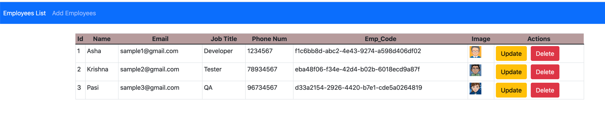
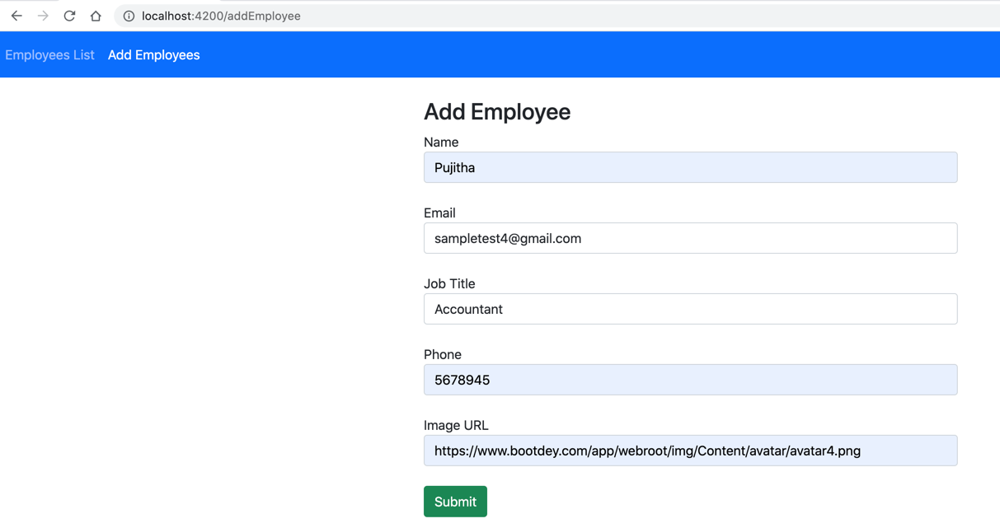
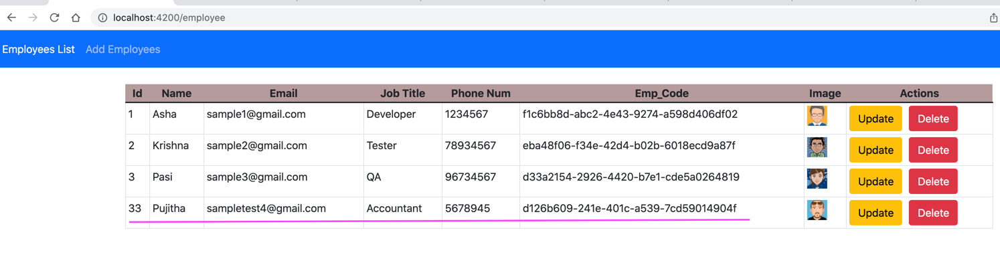
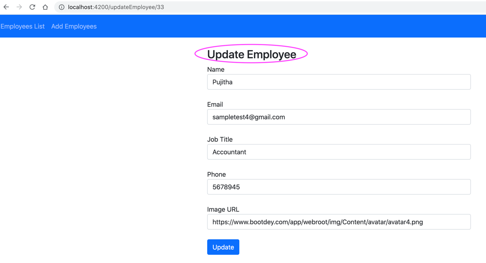
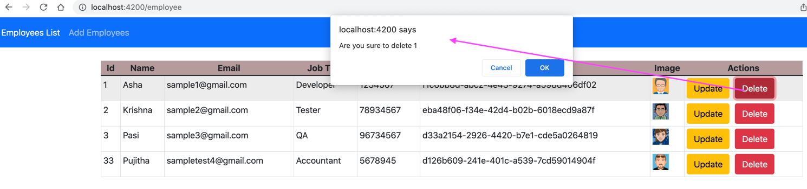

# angular-spring-api

1. Documentation is in Confluence page https://ashakrishna.atlassian.net/wiki/spaces/JAVA/pages/1002569867/Spring+with+Angular 
2. Start MySQL Server - see above confluence page
3. Run Spring Boot as a stand-alone application
4. Start Angular application. Open URL http://localhost:4200/
5. We can see employee-list

      

6. Add New Employee

     

7. Once new Employee is added we can that in the getEmployees list
     
     

8. We can update employee
    
     

9. Delete employee as well

    
